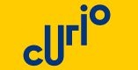

# Curio Open Dag - Software Developer Opleiding

Dit project is speciaal gemaakt voor de open dag van Curio, ter promotie van onze Software Developer-opleiding.

## Doel

Het hoofddoel van deze website is om informatie te verstrekken aan potentiële studenten en andere geïnteresseerden die de open dag bijwonen. We willen een overzicht bieden van wat onze opleiding te bieden heeft.

## Gebruik

- **Navigatie**: Ga naar de website om meer te ontdekken over onze opleiding en de open dag.
- **Informatie**: Vind hier details over ons curriculum, docenten, locatie en meer.
- **Contact**: Neem contact met ons op voor vragen of om deel te nemen aan de open dag.

Dank je wel voor je interesse in onze Software Developer-opleiding. We hopen je te verwelkomen op onze open dag!

(note: some of my conventions are implemented yet and have to be fixed)

# Web Development Conventions

In this document you will find the conventions I used to make this project. These rules are here to make it easyer to work togetter and to make every thing better to read.

## HTML
*spacing*
  -  use tabs to show the parent chill relation between difrten tages.
  -  one tab is the lengt of 4 spaces.

*naming conventions html*
  -  for class names always use CamelCase (example: class="LogoHeader).
  -  use logic names for classes so if your dont use class="img" for the logo use class="logo".
  -  use only one lagause for your classes (the laungeus you are making the project in).
## CSS
*spacing*
  -  one tab is the lengt of 4 spaces.
  -  always leave one line open between diftent objects.
  -  put the difrent stylings for the difrent parts of the websites in difrent block devided bye coment line that tells you wat it is abouth (example: /* =============================================header========================================== */)

